# Weather

### Average Temps in Jan and July

The big jump comes when CA and FL don't have winter temperatures below freezing!

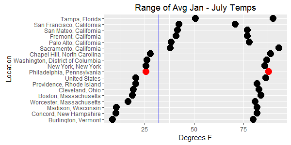

### Average Rainy and Sunny Days

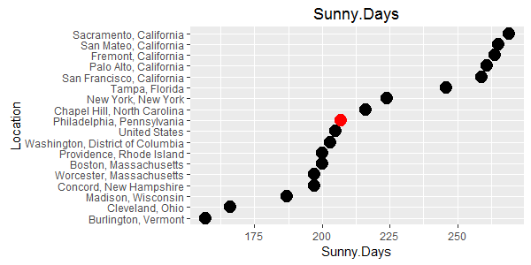
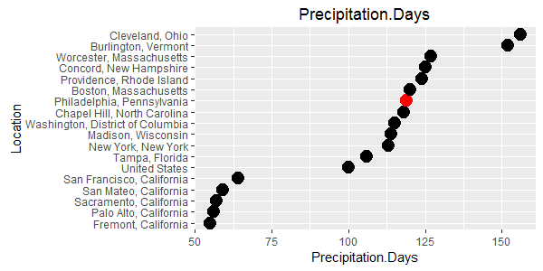

### Dreaded Snowfall

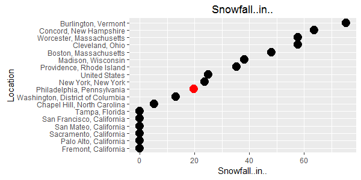

### Sun

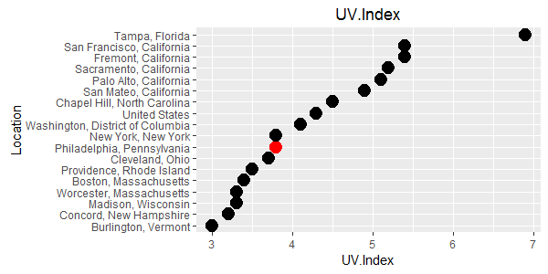

# Cost of Living

### Overall Cost of Living (Relative to US = 100)

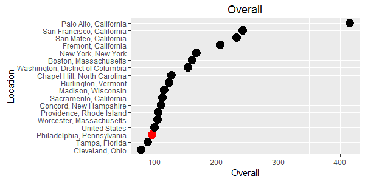

### Housing

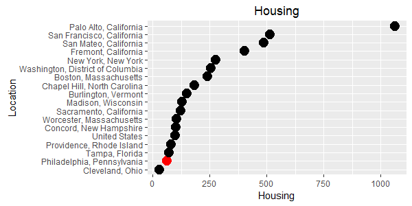

### Income Taxes (State + Local)

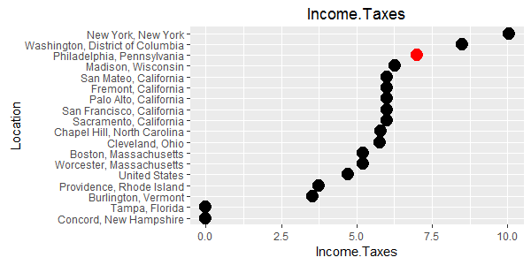

### Sales Taxes (State + Local)

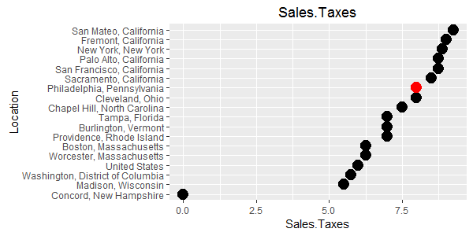

### Property Taxes

Value is dollar amount / $1,000 that the property is appraised at.

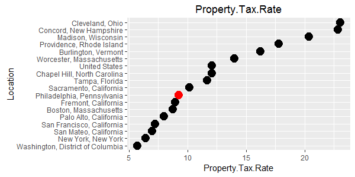

# Wealth

### Median Family Income

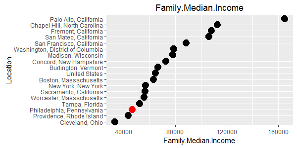

### Income Per Capita

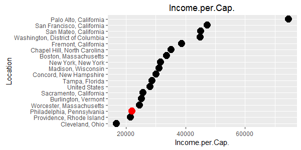

### Unemployment Rate

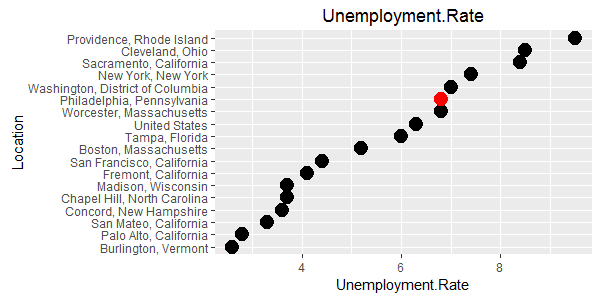

# Housing

I think these amounts are too low for CA. The data is likely too old.

### Median Home Age

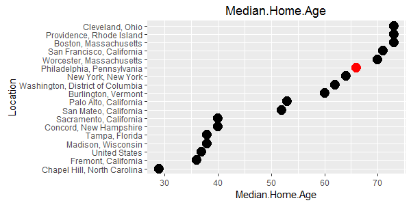

### Median Home Cost

### Avg 1-Bedroom Rent/Month

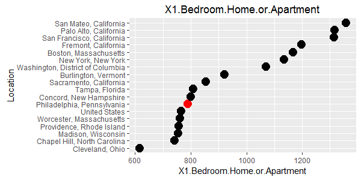

### Avg 2-Bedroom Rent/Month

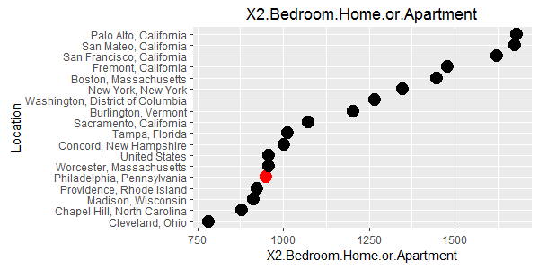

# Commute

### Avg Commute Time

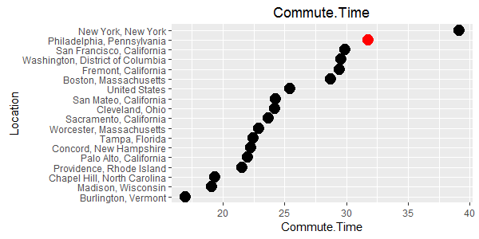

### % Riding Bicycles to Work
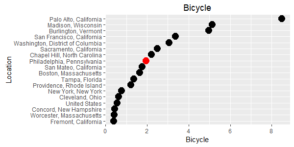

### % Taking Mass Transit

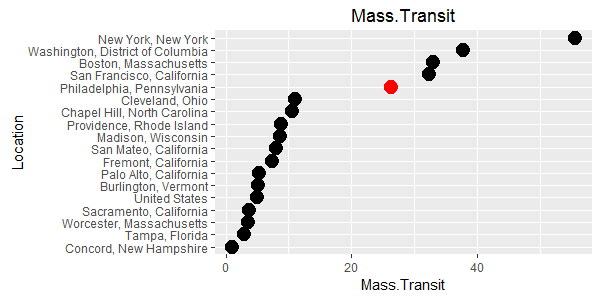

### % Walking

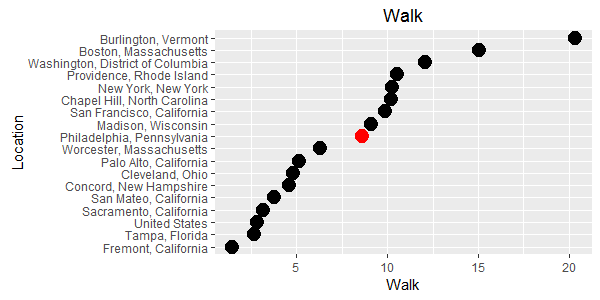

### % Working From Home

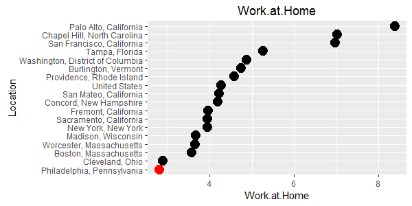

